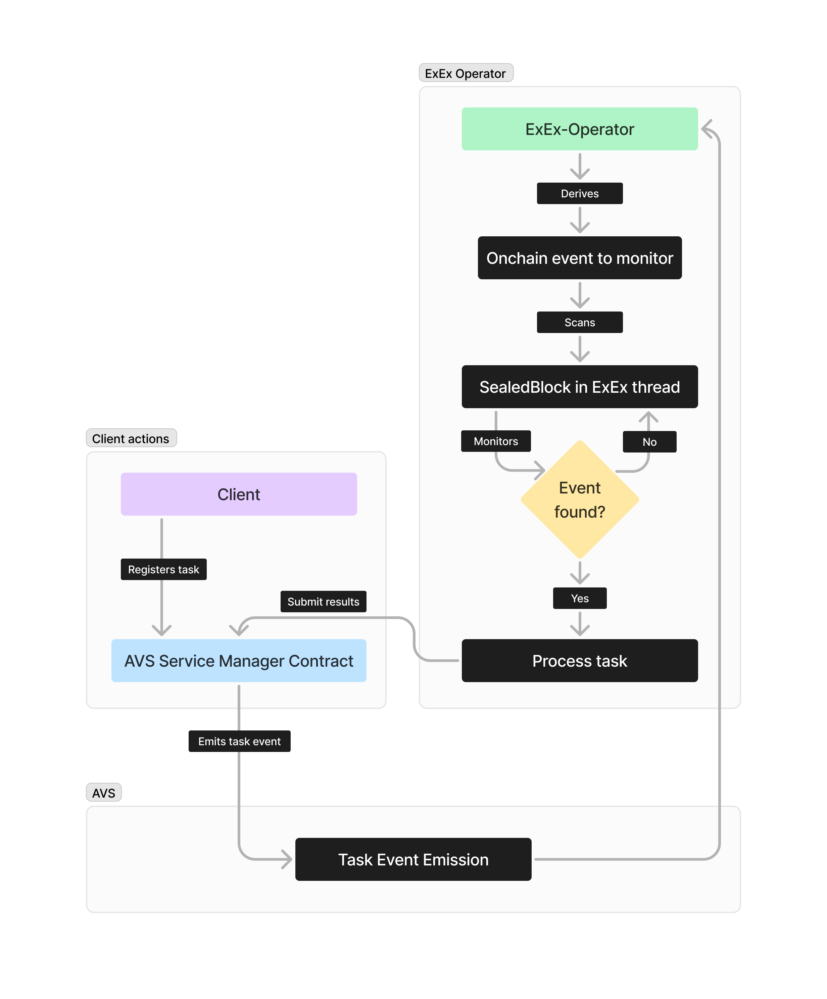

<p align="center">
  <a href="https://wvm.dev">
    
  </a>
</p>

## Synopsis 
Operators-As-ExEx is a paradigm that integrates partially or completely the operator of an Actively Validated Services as [Execution Extensions](https://exex.rs) in Reth. This approach aligns perfectly with events-driven activated predefined-actions (EDAs) such as Keeper Networks.

## About This ExEx
This ExEx is the re-implementation of Eigenlayer's [hello-world-avs](https://github.com/Layr-Labs/hello-world-avs) as an ExEx. this work comes to demonstrate in practice how the Operator-As-ExEx paradigm works.

## Low Latency EDA

This ExEx shows how to build a high-performance EDA-AVS-Operator by minimizing network latency. Rather than continuously polling JSON-RPC endpoints for AVS Service Manager smart contract events or monitoring blockchain events, this implementation uses direct ExEx notifications that has shared memory communication with the Reth node.

The operator initializes the RPC provider just once, using it only when submitting task results. All other monitoring/polling - whether for new AVS tasks or EDA-task completion events - happens through ExEx notifications instead of current polling methods in AVS operators.

## Operators-As-ExEx Workflow


## Run it

First of all, make sure to setup your `.env` file according to [.env.example](./.env.example) 

```bash
git clone https://github.com/weaveVM/hello-world-avs-as-exex.git

cd hello-world-avs-as-exex

cargo build

cargo run -- init --chain holesky --datadir data

cargo run node
```
#### N.B: you need to run a CL along the EL (Reth). [Checkout Lighthouse](https://reth.rs/run/mainnet.html#running-the-consensus-layer)

## License
This project is licensed under the [MIT License](./LICENSE)